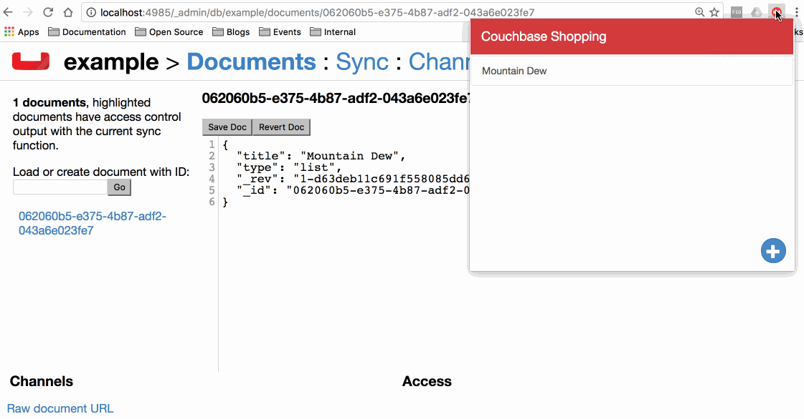

# Couchbase in a Google Chrome Extension, Example

This is an example to demonstrate creating a Google Chrome extension with Angular 2 that uses PouchDB to replicate data to Couchbase Sync Gateway and eventually Couchbase Server.



## Installation and Configuration

After downloading this project, navigate into **AngularExtension** and execute the following commands:

```
npm install
ng build --output-path=../public
```

Navigate backwards to the root directory of the project and copy the **manifest.json** and **icon.png** files into the freshly created **public** directory.

Enable developer extensions in Google Chrome and import the public directory which now represents the unpacked extension.

## Resources

Couchbase - [http://www.couchbase.com](http://www.couchbase.com)

PouchDB - [https://pouchdb.com](https://pouchdb.com)

Angular - [https://angular.io](https://angular.io)

The Polyglot Developer - [https://www.thepolyglotdeveloper.com](https://www.thepolyglotdeveloper.com)